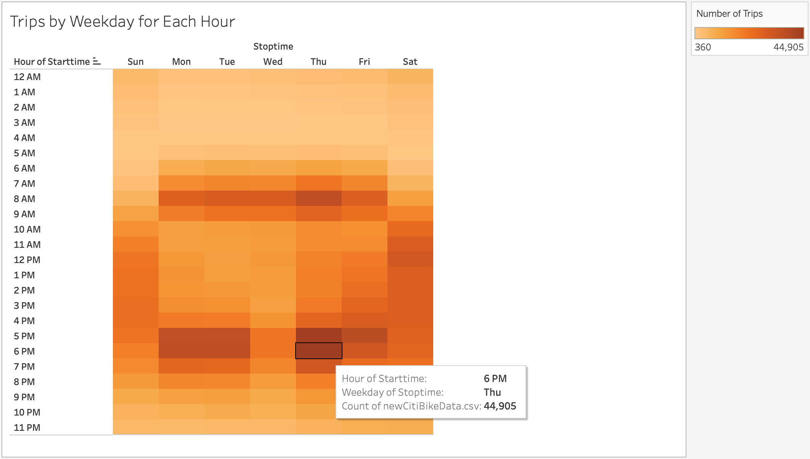
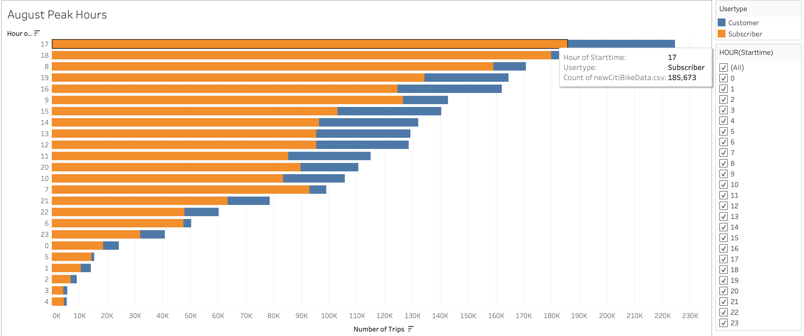

# Bike-Sharing Program 

## Overview

### Purpose

The purpose of this analysis is to provide investors a comprehensive bike trip analysis to demonstrate a bike-sharing program in Des Moines, Iowa is a solid business proposal. The bike-sharing program is presented as an eco-friendly service to locals and tourists in the greater Des Moines; the fastest-growing metro in the Midwest. 

For this analysis, Python and Pandas functions were used to change the "tripduration" column from an integer to a datetime data type. Additionally, by performing an exploratory analysis on the NYC Citi Bike trip data for the month of August, a set of high-quality visualizations was created using Tableau. Now, investors have all the data they need to make an educated decision on the two-wheel venture. Let’s go!

  
  

&nbsp;

## Results

### Files and Links

The analysis is supported by the following:

* Code - Datetime Data Type Conversion: [NYC_CitiBike_Challenge](NYC_CitiBike_Challenge.ipynb)
* Tableau Public Link: [Bike-Sharing Program](https://public.tableau.com/views/Bike-SharingProgram/Bike-SharingProgram?:language=en-US&publish=yes&:display_count=n&:origin=viz_share_link)

### Software and Application

The software and web-based application used for this analysis are:

* Python Version 3.7.11 (using PythonData environment and Pandas Library)
* Jupyter Notebook Version 6.4.6
* Tableau Public Version 2021.4.4

### Outcomes 

In the initial stage of data exploration of the Citi Bike trip data, it was found that there was a total of 2,344,224 bike rides recorded during the month of August in New York City. Of which, 1,900,359 or 81% were from subscribers and 443,865 or 19% from customers. This total number of bike rides can also be viewed by gender breakdown. This means, 1,530,272 or 65% were male users, 588,431 or 25% were female users and 225,521 or 10% were unknown users. 

For this analysis, the genders are identified as male, female and unknown and the user type is identified as customer or subscriber.

Moreover, a set of interactive visualizations were created to display key findings of bike trips in New York City during the month of August. To interact with the graphs please refer to the above link posted under 'Files and Links'. Lastly, a description of the results for each visualization is included as well. 

&nbsp;

**Checkout Times for Users**

In this visualization, a line graph displays the number of bikes checked out by duration for all users, that is customers and subscribers. Along the x-axis are the minutes of a trip duration, and the y-axis is the number of bikes. The line graph can be filtered by the hour for further comparison. For example, there were 146,752 bikes that were checked out between 12 AM and 1 AM with a trip duration of 5 minutes as shown in the graph. 

&nbsp;

**Checkout Times by Gender**

In this visualization, a line graph displays the number of bikes checked out by duration for each gender; that is male, female or unknown. Along the x-axis are the minutes of a trip duration, and the y-axis is the number of bikes. The line graph can be filtered by gender and the hour for further comparison. Also, the line graph is color coded orange for male, blue for female and red for unknown. For example, the orange line states that 108,087 male users checked out a bike between 12 AM and 1 AM with a trip duration of 5 minutes as shown in the graph.

&nbsp;

**Trips by Weekday for Each Hour**

In this visualization, a heatmap is created showing the number of bike trips for each hour of each day of the week. Along the x-axis is the stop time filtered by weekday, and the y-axis is the start time filtered by the hour. The darker the block the higher the number of trips. For example, the highest number of bike trips are on Thursdays recorded at 44,905 between 6 PM and 7 PM. 

&nbsp;

**Trips by Gender (Weekday per Hour)**

In this visualization, a heatmap is created showing the number of bike trips by gender for each hour of each day of the week. Along the x-axis is the gender and the stop time filtered by weekday, and the y-axis is the start time filtered by the hour. The heatmap can be filtered by gender as well. As noted earlier, the genders are identified as male, female and unknown. For example, the highest number of bike trips are on Thursdays recorded at 30,749 by male users between 6 PM and 7 PM.   

&nbsp;

**User Trips by Gender by Weekday**

In this visualization, a heatmap is created showing the number of bike trips for each type of user and gender for each day of the week. Along the x-axis is the gender, and the y-axis is the user type and the start time filtered by the weekday. The heatmap can be filtered by user type and gender as well. As noted earlier, the user type is identified as customer or subscriber. The darker the block the higher the number of trips. For example, the highest number of bike trips are on Thursdays recorded at 259,316 by subscribers identified as male. 

&nbsp;

**August Peak Hours**

In this visualization, a horizontal bar graph is created showing peak riding hours by user type during the month of August. Along the x-axis is the number of trips, and the y-axis is the start time filtered by the hour. The bar graph can be filtered by user type and hour as well. As noted earlier, the user type is identified as customer or subscriber. Also, the bar graph is color coded orange for subscriber and blue for customer. For example, the first orange bar states that 185,673 subscribers checked out a bike between 17 hours or 5 PM and 18 hours or 6 PM, which is the highest peak riding hour as shown in the graph.

&nbsp;

**Top Starting Locations**

In this visualization, a symbol map is created showing the most popular stations in New York City for starting a bike journey by user type during the month of August. The symbol map can be filtered by user type as well. As noted earlier, the user type is identified as customer or subscriber. The symbol map is color coded to identify the top starting locations; dots closer to the red color are more popular locations and dots closer to the blue color are less popular locations. For example, the dark red dot as shown on the symbol map is Pershing Square North where Grand Central Station is located, and it is the most popular location to start a bike ride with a record of 16,564 users.

&nbsp;

      
## Summary 

One trend we can observe based on this analysis is that male riders and subscribers are the main users of the bike-sharing program. In addition, the data shows that it is also commuters that travel to and from the city that use the Citi bikes the most. A main reason could be work and education in Manhattan to be precise. To support this concept, below are two additional visualizations suggested for future analysis. These visualizations show exactly the top 10 starting and ending bike stations, which coincide with the most transited train and subway stations as well as ferry terminals around the city. Thus, providing more in-depth data about the demand of Citi Bikes in New York City.   

1.**Top 10 Starting Stations**

In this visualization, a horizontal bar graph is created showing the top 10 starting stations by user type during the month of August. Along the x-axis is the number of trips, and the y-axis is the start station name. The bar graph can be filtered by user type as well. As noted earlier, the user type is identified as customer or subscriber. Also, the bar graph is color coded orange for subscriber and blue for customer. For example, the first orange bar states that 14,571 subscribers checked out a bike at Pershing Square North where Grand Central Station is located making it the number one starting station in all New York City as shown in the graph.

2.**Top 10 Ending Stations**

In this visualization, a horizontal bar graph is created showing the top 10 ending stations by user type during the month of August. Along the x-axis is the number of trips, and the y-axis is the end station name. The bar graph can be filtered by user type as well. As noted earlier, the user type is identified as customer or subscriber. Also, the bar graph is color coded orange for subscriber and blue for customer. For example, the first orange bar states that 14,572 subscribers checked in a bike at Pershing Square North where Grand Central Station is located making it the number one ending station in all New York City as shown in the graph.

&nbsp;

&nbsp;

In conclusion, an exploratory analysis on NYC Citi Bike trip data was completed to create a set of visualizations using Tableau. Additionally, Python and Pandas functions were used to change the "tripduration" column from an integer to a datetime datatype. Overall, this analysis provides investors a comprehensive bike trip analysis to demonstrate a bike-sharing program in Des Moines, Iowa can be a solid venture.
